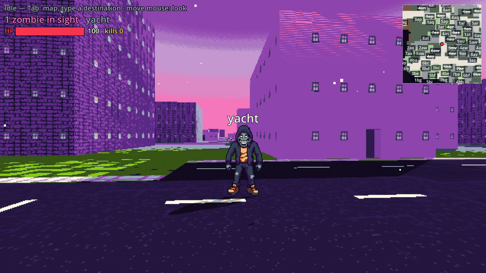
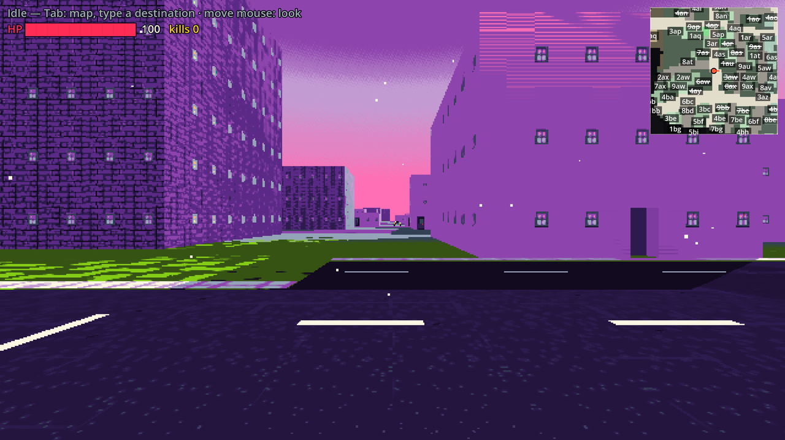
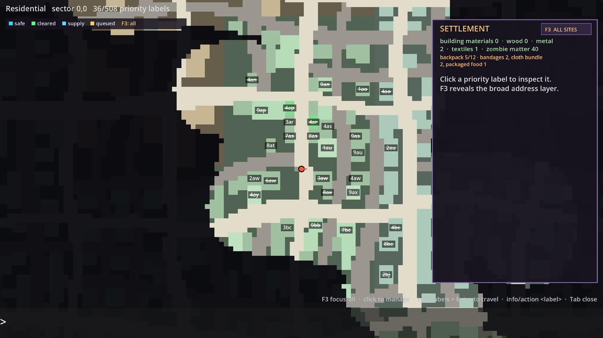
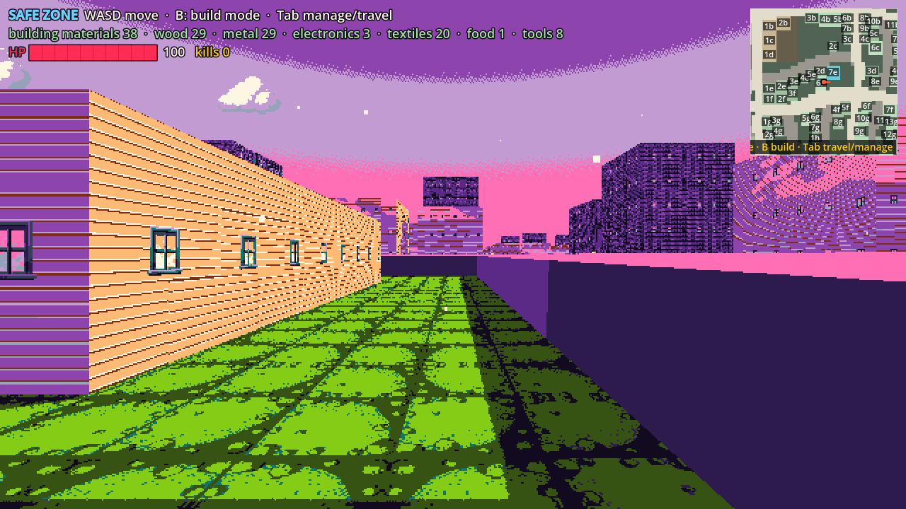
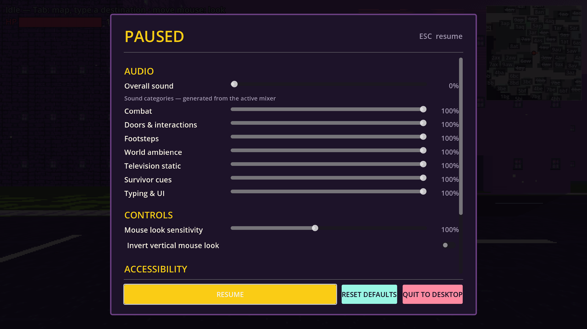

# Zombietyping

[](https://github.com/lettucegoblin/zombietyping/actions/workflows/build-and-deploy.yml)
[](https://godotengine.org/)

A first-person typing survival game set in an infinite procedural city. Type addresses to
travel, breach doors one letter at a time, clear generated apartments, rescue survivors,
salvage the city, and turn secure ground into a growing settlement. Every letter typed at a
zombie is a bullet.

[Play the latest browser build](https://lettucegoblin.github.io/zombietyping/) ·
[Download desktop builds](https://github.com/lettucegoblin/zombietyping/releases)



[Watch the quick-cut gameplay trailer](docs/media/zombietyping-gameplay-trailer.mp4) ·
[Watch the original uncut take](docs/media/zombietyping-gameplay-longform.mp4)

| Procedural street view | Persistent city map |
|---|---|
|  |  |
| **Settlement construction** | **Accessible settings and audio mixer** |
|  |  |

Zombietyping is an early playable prototype built in Godot 4.6.2. The city, buildings,
apartment layouts, room programs, encounters, salvage, and settlement opportunities are
generated deterministically from the world seed. The current direction combines the arcade
clarity of a typing shooter with deliberate room clearing and a low-pressure, permanent
settlement game: claimed walls stay safe, and expansion creates new places to live rather
than another upkeep timer.

## Highlights

- Infinite streamed city generation informed by tensor-field urban-layout techniques.
- Procedural multi-storey buildings with apartments, bedrooms, kitchens, bathrooms, doors,
  windows, furnishings, loot, and room-aware encounters.
- Type-to-travel navigation, physical door breaches, line-of-sight combat, and readable
  route guidance through cleared and unexplored spaces.
- Stable building addresses shared by the world view, minimap, and full map.
- Persistent salvage, vehicle teardown, walls, farms, furnishings, resident homes and
  schedules, jobs, supply links, safe-zone expansion, and resource-backed healing.
- A forced 21-colour comic palette, directional character animation, positional sound, and a
  dynamic audio mixer.

## Controls

| Input | Action |
|---|---|
| Type the visible word | Travel, interact, open a door, rescue, or attack |
| Mouse | Look around in first person |
| `Tab` | Pause, open the city/building map, and use field or safehouse care |
| `Esc` | Pause and open settings |
| `WASD` | Move freely inside a claimed safe zone |
| `T` | Talk to the nearest safe-zone resident (dialogue appears above them) |
| `P` | Pet the nearest cat or dog |

## Run locally

Open `project.godot` in Godot 4.6.2 and run the main scene. Release exports are produced by
the repository workflow for Web, Linux, Windows, and unsigned macOS builds. The browser build
is deployed to GitHub Pages after every successful build on `master`.

`NEXT_STEPS.md` tracks the current backlog and open design questions. The rest of this file
is the technical guide for contributors.

---

## 1. Design pillars

- **Art:** one forced 21-colour palette (`assets/palette/palette.png`), kawaii/emoji zombie
  faces, Vice-City poppy colours, thick outlines, weighted comic strides. Every PixelLab
  generation passes the palette (`color_image_base64`) and every imported frame is quantized
  onto it. **Seed new characters from a STATIC, forward-facing neutral pose** (mid-action
  seeds made the motion clunky). Have the owner confirm a new character's idle pose before
  spending generations on animations.
- **No gun sprite.** Letters are the bullets.
- **Nothing sees you before you see it.** Zombies wake by line of sight or gunfire only.
- **Fair jumpscares are not jumpscares:** a zombie may only hurt you while its word is on
  screen and has been readable for a beat.
- Rails in the unsafe city; WASD is only enabled inside a claimed perimeter. Tab pauses and
  opens the map. Mouse movement looks around without a button; opening a menu releases the
  pointer, and closing it recaptures it. Scripted doorway beats briefly retain priority so
  their action remains readable. Buildings use stable, fixed-width digit-first addresses
  (`1aa` … `9zz`) across the minimap, Tab map, and first-person reticle, so they can be
  typed from the HUD without opening the map.
- Typing a building address outside now keeps a stable candidate in view and mirrors the
  yellow address at screen centre; completing it leaves a short confirmation beat before
  travel begins. This keeps distant destinations spatially legible without making the mouse
  reticle mandatory.
- Esc opens a persistent settings menu. Audio is routed through separate combat, interaction,
  footsteps, ambience, television, survivor, and typing/UI buses under an overall volume;
  the menu generates those rows from `GameSettings.AUDIO_BUSES` so future categories remain
  a data addition rather than a UI rewrite. It also owns mouse look, display, and accessibility
  preferences (shake, hit flash, and world typing-text scale).

## 2. Running things

| What | How |
|---|---|
| Godot binary | `/Users/lettuce/Documents/Godot.app` (4.6.2 stable) |
| Open the editor | `open -a /Users/lettuce/Documents/Godot.app --args --path /Users/lettuce/zombietyping --editor` |
| Run the game from the editor | via MCP: `python3 tools/live/run_and_shot.py run` (see §8) |
| Headless test (scene) | `tools/gd.sh <seconds> res://scenes/tests/<name>.tscn` |
| Parse every script | `tools/gd.sh 40 -s res://scripts/tests/parse_check.gd` |

`tools/gd.sh` is a headless runner with a time cap (macOS has no `timeout`). Tests that need
autoloads (`World`) **must run as scenes**; `-s` scripts never instantiate autoloads and
report `Identifier not found: World` — ignore those lines from the parse check.

### Tests (all headless, exit code 0 = pass)

| Scene | Covers |
|---|---|
| `scenes/tests/test_combat.tscn` (~1 min) | LOS + typing lock, stun on hit, wrong letter no advance, re-lock on the NEXT letter, rail halt, damage + i-frames, re-lock after a hit, word clamped on screen when a zombie is in your face, door throw-back, notice beat, fairness timing |
| `scenes/tests/test_camera_control.tscn` | kicked-door camera lock plus mouse-look priority over ambient auto-aim |
| `scenes/tests/test_pause_menu.tscn` | Escape pause ownership, dynamic mixer sliders, sound routing, and live accessibility controls |
| `scenes/tests/test_gameloop.tscn` (~2 min) | Tab map labels → queue two buildings → arrivals in order, fog reveal, sparse state, HUD-typed travel, and crossed-out-but-typeable revisited doors |
| `scenes/tests/test_loot.tscn` | deterministic container contents, field-kit priority and overflow, backpack capacity/state, duplicate prevention, breakdown yields, and save/load |
| `scenes/tests/test_auto_loot.tscn` | clear-room reward beat, automatic container persistence, world-to-HUD item flights, and arrival-synchronized field-kit/backpack counts |
| `scenes/tests/test_settlement.tscn` | clear ≠ claim, material-class salvage, four-stage vehicle teardown, fortify, road-or-joined-ward expansion, claim, persistent furniture placement, and cart-party carrying/unloading |
| `scenes/tests/test_safezone_transition.tscn` | at-door claim clears camera/threat locks, entry auto-stores loot before field-kit refill, proximity-held stair travel, safe-zone furniture remains decorative, and the gate walk reaches an outside road |
| `scenes/tests/test_tab_map.tscn` | stable fog-independent addresses, center-reticle building picking, collision-free map label nudging, supply-route caching/invalidation, menu/gameplay pointer handoff, and panel input capture |
| `scenes/tests/test_construction.tscn` | placement ghost validity, rotation, confirm/cancel, full undo, partial dismantle, and upper-floor farm rejection |
| `scenes/tests/test_room_visibility.tscn` | partition-safe entrances, room-tinted ceilings, unrevealed structural occlusion, hidden encounters, and furniture sprite alpha |
| `scenes/tests/test_word_overlay_layout.tscn` | typed-prefix priority, collision-free label nudging, and edge-hint sliding constraints |
| `scenes/tests/test_citizen_navigation.tscn` | deterministic yard routing around buildings, farms, walls and furniture, plus rebuild-position preservation |
| `scenes/tests/test_rescue_loop.tscn` | deterministic semantic-room survivor target, rescue-priority guidance, typed `help`, directional cue lifecycle, pending roster, save/load, base assignment, and named citizens |
| `scenes/tests/test_survivor_cue.tscn` | stable positional rescue cadence, range gating, 3D attenuation/panning, movement, and permanent shutdown on resolution |
| `scenes/tests/test_facility_profile.tscn` | generated room/prop utility totals, dismantled-prop subtraction, deterministic facility role, and claim-aware readiness |
| `scenes/tests/test_workforce.tscn` | trait-aware jobs, staffed farm output, disconnected local stock, supply-route delivery, work cycles, and persistence |
| `scenes/tests/test_survivor_needs.tscn` | backpack deposits, base provisions, hunger, morale, injury treatment, labor gating, and needs persistence |
| `scenes/tests/test_facility_upgrade.tscn` | role locking, material/staffing gates, production bonuses, utility damage taking upgrades offline, and save/load |
| `scenes/tests/test_interior.tscn` (~5 min, run it ALONE) | full clear loop: door word → enter → fight → open doors → climb (stairwell landing) → auto-return from dead ends → down → exit → next building |
| `scenes/tests/check_stairs.tscn` | generator invariants over ~900 storeys: stair consistency, doors with words, full cell coverage/connectivity, complete apartment programs (living/kitchen/bathroom/bedroom), corridor access, and furnishing coverage |
| `scenes/tests/check_fling.tscn` | a kicked door leaf really flies (physics) |
| `scenes/tests/print_plan.tscn` | prints ASCII floor plans of the first apartment blocks (debug) |

Chaining all of them in one shell call blows the 10-minute tool limit; run the interior test
on its own.

## 3. Layout

```
project.godot            main scene res://scenes/main.tscn; autoloads World, _mcp_game_helper
scenes/main.tscn         the whole game scene (see §4)
scripts/
  main.gd                game modes, prompts, arrivals, search rails, HUD, debug keys
  world/                 infinite city: det.gd (hashes), district.gd, city_gen.gd, sector_data.gd,
                         building_data.gd, world.gd (autoload: state, fog, A*), streamer.gd,
                         sector_mesher.gd (facades, doorways, colliders), palette.gd,
                         ash.gd (dust particles), sky_life.gd (clouds + crows)
  interior/              floor_plan.gd (data), interior_gen.gd (BSP + apartment plans),
                         stairwell.gd (stair layouts/geometry/paths), interior_mesher.gd
                         (rooms, doors, glass, labels), interior.gd (the loaded storey)
  player/rail_player.gd  the rail: street legs (A* tiles) + local legs (points), hold/halt
  settlement/            sparse-state settlement rendering: walls/gates, salvage cars,
                         placed furniture, farm plots, citizens, and safe-zone build controls
  typing/                typist.gd (keyboard → prompts/zombies/destinations), word_label.gd,
                         word_overlay.gd (draws words on the UI layer), words.gd (pool)
  zombies/               zombie.gd (state machine), director.gd (spawns, LOS, targeting),
                         zombie_type.gd (runner/shambler stats), zombie_frames.gd (SpriteFrames)
  map/                   map_labels.gd (stable shared addresses), tab_map.gd, minimap.gd
  ui/building_reticle.gd outdoor center dot + visible-facade address ray
  audio/sfx.gd           local + true-3D one-shots, semantic-room ambience layers/events
  tests/                 the scenes above + parse_check.gd
shaders/                 cel.gdshader (city), flat.gdshader (interiors), palette_post.gdshader
assets/                  palette/, textures/atlas.png (+ source tiles), sprites/zombie/<type>/,
                         sprites/sky/, audio/*.wav (procedural, see tools/make_sounds.py)
tools/                   gd.sh, import_character.py, make_sounds.py, live/ (MCP drivers, §8)
design/                  contact sheets and reference screenshots from the art direction work
```

## 4. Scene and rendering

`Main` → `View` (SubViewportContainer, stretch, shrink 2) → `Viewport` (SubViewport 640×360,
nearest filter: the pixel look) → `World` (Env, Sun, Streamer, Interior, Director, SkyLife,
Player+Camera3D+Ash) and a `Post` CanvasLayer with `PaletteQuantize` (palette_post shader:
nearest-palette selection with a narrow two-swatch handoff; F1 toggles it, F2 toggles
dither). Beside the view: `Typist`, `Sfx`, and the `UI` CanvasLayer at full 1280×720: `HUD`
(RichTextLabel with ink outline), `Minimap` (top right), `BuildingReticle`, `Words`
(WordOverlay), `Flash`, `GameOver`, `TabMap`. UI node ORDER matters: Words must come after
HUD/Minimap/BuildingReticle (draws above them) and before TabMap.

- Sky: ProceduralSkyMaterial purple→hot pink (quantizes into comic bands). Depth fog
  30–150 m lilac. Clouds have fog disabled.
- City meshes use `cel.gdshader` (atlas cells via UV2, stochastic tile flips + noise
  weathering to hide repetition, and a smooth close-pixel→mip-filter handoff). Interiors use unlit `flat.gdshader` with baked shading
  (lit interiors + palette snap produced light-falloff blobs).
- Godot front faces are CLOCKWISE; `SectorMesher._quad4` fixes winding from the normal.

## 5. The city

Deterministic and infinite from `World.seed`. Sector = 32×32 tiles, tile = 5 m. Sectors are
streaming chunks only: the road plan is classified directly in global tile space from a
continuous, seed-oriented coordinate field with low-frequency domain warp. Nested contours
produce a hierarchy of avenues (48-tile cadence), collectors (24), and density-controlled
local streets. Locals terminate on collectors and are retained per superblock, creating
loops, T-junctions, and occasional cul-de-sacs without the old sector-framing lattice.
Curving lane markings follow the same field. The approach is informed by the tensor-field
urban-layout method in the Purdue SIGGRAPH 2011 course notes, but keeps one coherent regional
bearing so rasterized streets remain four-connected.
Polycentric density and flavour fields select districts; their parameters control branch
density, lots, setbacks, and height. Building uses are procedural (`apartments`, `house`,
`shop`, `office`, `warehouse`) rather than a generic shell, and are chosen from district,
lot geometry, density, and stable hash rolls. Buildings retain stable ids `"sx,sy:i"`, floors,
a door tile and a road tile (the A* node in front of the door). `World.state` is a sparse
dictionary of building state (visited, door_kicked, floors/rooms cleared, salvage,
fortification, supply and claim progress); `World.materials`, `supply_links`, and `placements`
hold the procedural settlement economy and player construction;
`World.explored` is a fog bitmask per sector. Streamer keeps a radius of sectors built (one
per frame).

Settlement state autosaves to `user://settlement.save` through a versioned binary envelope.
The atomic temp/backup rotation preserves Godot-native vectors, packed fog arrays, stable
building state, searched containers, backpack contents, materials, links, farms, furniture,
and car teardown stages. Corrupt primary
saves fall back to the previous backup; headless tests never touch the player's save.

Facades: walls from `InteriorGen.footprint(b)` (single source of truth for the inset), a real
hole for the door, a dark "vestibule" box behind it (per-sector MultiMesh, hidden while that
building's interior is loaded so you can see in), a door-leaf MultiMesh (collapsed once
kicked; persisted in state), window sprite bands from the same `window_slots()` the interior
uses, and one box collider per building (blocks line of sight; disabled for the building you
are inside).

### Settlement loop

Clearing a building is only a tactical milestone and never makes it claimable by itself.
Click its label in the Tab map (or type `info <label>`) to open the building panel. The loop is:

1. Clear generated rooms, collect their container rewards into the field kit/backpack, then
   salvage the generated furnishings into material classes after claiming the site.
2. Dismantle seed-placed street cars over four persistent visual stages, ending as a frame
   on blocks; stages yield metal, electronics, fuel, tools, and vehicle parts.
3. Spend wood/metal/building materials to construct a gated perimeter.
4. The first base can then be claimed; later sites require a road-valid supply line from an
   existing claim before claiming.
5. Arriving at—or claiming while standing in—a claimed building enters safe-zone mode:
   WASD moves with generated wall/door collision, walking through the visible gate restores
   typed street travel, and `PageUp/PageDown` changes storeys. `B` toggles build mode, `Q/E`
   selects wall/crate/bed/chair/farm, arrow keys nudge a world-stable placement cursor, `C`
   recenters it, and `F` places it. Farms produce food and seed-derived citizens walk
   deterministic waypoints inside the perimeter.

A centered, fading control card marks that handoff: a pixel-art WASD cluster appears on
settlement entry, and a pixel-art keyboard appears when typed street travel resumes.

Generated furnishings retain stable object IDs after claiming. Walk close to an intact item
and press `X` to dismantle that specific bed, television, fridge, rug, fixture, or other prop;
the object disappears, its material-class yield is shown, and the removed ID persists in the
save. Build mode provides a green/red placement ghost: `R` rotates, `F` confirms, `Esc`
cancels, and `U` gives a ten-second full-refund undo before dismantling the nearby placed
object for a 50% rounded-up refund. It never silently removes the newest object elsewhere.

Searchable dressers, cabinets, shelves, fridges, crates, televisions, stoves, and workbenches
roll contents from their procedural loot-table tag and stable prop ID. While a room is
dangerous, unsearched containers have a subtle proportion-weighted hop, six gold collectible
motes, and an on-object `SUPPLIES` marker. Once it is safe, route typing pauses for a short
reward beat and every carryable unit arcs from its world position into the top-left inventory
chip. Bandages and packaged food fill two ready-use field slots each; overflow and all other
loot use the persistent twelve-slot backpack. Consumption drains backpack overflow before the
field reserve. Entering a settlement refills open field slots from that base's stored supplies,
and `G` stashes the backpack before performing the same refill. The number, color pulse, and
rising pickup cadence land together; full carried storage leaves remaining supplies visibly in
place. Outside claimed buildings, searched containers are dimmed and marked `EMPTY` on return;
inside a safe zone, the same furnishings are decoration with no loot state or marker. `V` sorts
backpack contents into construction material classes, `H` uses bandages, and `J` eats packaged
food. Only searched prop IDs are saved—the contents themselves regenerate deterministically
from the world seed.

Eligible uncleared buildings also receive a deterministic named survivor in a semantic room.
The room/floor route takes priority over irrelevant cleared branches, the survivor emits a
distance-filtered directional knock from their exact generated location, and `help` becomes
typeable only after their room is safe. Rescues persist in a pending roster until a base is
claimed, then become named citizens at the nearest claimed base. The procedural roster
includes adults, grandmothers, grandfathers, ordinary quadruped cats, and ordinary quadruped
dogs. The animals inexplicably talk. Citizens use archetype-specific sprites, receive
persistent homes, and follow deterministic home, work, community, and patrol schedules around
obstacle-aware safe zones. Only the first base gets a single founder automatically; later
settlement population comes from rescues.

The Tab building panel derives each site's role and beds/storage/water/power/comfort capacity
from its complete procedural room program and still-intact generated props. Dismantled prop
IDs stop contributing immediately, so the panel's upgrade readiness describes the physical
building instead of a parallel abstract economy.

Claimed bases run one persistent work cycle every 45 seconds. Rescued residents receive a
trait-aware default job and can be reassigned from the Tab building panel (`Auto-assign crew`)
or with `job <label> farmer|scavenger|builder|mechanic|medic`. Farms only produce when tended;
mechanics and medics require the relevant intact workshop, power, water, and storage; builders
and scavengers recover material classes. A disconnected outpost keeps output in a local
stockpile, and a restored road supply link delivers the backlog into the shared inventory.

Each claimed building can be upgraded three times in its generated facility role from the Tab
panel or with `upgrade <label>`. Levels require an equal number of residents plus role-specific
materials. Kitchens improve tended plots, depots improve scavenging, workshops improve builder
and mechanic output, shelters improve staffed care, and operations centers coordinate
electronics recovery. The first upgrade locks the role to that physical building; dismantling
required beds, storage, water, or power takes it offline until those utilities are restored.
Installed levels add a role-coloured rooftop beacon; an offline facility's beacon turns dim
red, so utility damage is visible in the safe zone as well as the management panel.

Every work cycle can improve resident wellbeing, recovery, and morale. One optional food unit
feeds two people; deposited packaged food and bandages are consumed before connected material
stores, while a cut-off outpost can use only its own stockpile. People always recover and keep
contributing: meals, medicine, comfort, and high morale grant positive productivity bonuses
instead of turning the settlement into an upkeep timer. The Tab building panel reports each
base's wellbeing and each named resident's condition; all progress persists.

The Tab map also exposes immediate care without adding another twitch control: backpack and
field-kit bandages provide field healing, while a selected safehouse can treat the player from its
stored or connected medical supply when the player is physically inside that safe zone.
Safe-zone entrance doors fill their frames and swing open automatically as the player
approaches, then close after the player moves clear. They are visual-only inside permanent
safe ground, so an animated leaf can never trap the player. Once a founding shelter exists,
new sessions begin in its safe courtyard instead of back at the original street spawn.
Walking into any claimed settlement automatically unloads carried salvage into that base,
then refills the field kit from its stores. Each gate has a persistent expedition cart:
stand beside it and press `K` to add rescued human residents (up to two) or clear the crew.
Assigned companions follow the player in the city, the cart plus crew expands real backpack
capacity, and the whole cargo is unloaded on the next settlement entry. Cats and dogs remain
talking home companions rather than freight labor. In a multi-storey safehouse, standing at
an up/down stair marker fills a short circular hold indicator and changes floors; moving away
cancels it and each landing must be left before it can trigger again.

Fortified perimeters combine building materials with zombie matter. They are permanent safe
ground: outdoor zombies cannot spawn or remain inside them, and they never decay or trigger
raids. Player-built wall segments snap to a 2.5 m procedural grid. An open run is only a
barrier; closing a loop automatically adds every enclosed cell to the safe zone, expands WASD
building/citizen space, and allows furnishing and farms there. When expanded safe ground joins
another base, shared logistics work without the old road supply line—the caravan is a bridge
to expansion, not recurring maintenance.

The Tab panel also accepts `salvage`, `car`, `fortify`, `supply`, `claim`, and `farm` followed
by a current map label. All geometry and yields derive from stable building/prop seeds; only
the player's sparse mutations are stored.

## 6. Interiors

`InteriorGen.generate(seed, building, floor)` → `FloorPlan` (cells of ~2.0 m, semantic rooms,
procedural furniture, doors with typeable words, entrance on floor 0 exactly where the
facade door is). Topology and furnishing use separate stable RNG streams, so adding a prop
does not perturb the room graph or its door words. Two planners:

Bedrooms also derive a deterministic personality theme: bed side, larger dresser, rug
dimensions/palette, wall-safe poster, console or desk choices vary with the furnishing RNG.
All sprite extents participate in collision/door-lane settling, while posters use the same
wall-plane and door/window exclusion pass as paintings.

- **BSP** (`_plan_bsp`): rooms by BSP, a **stairwell strip** carved out of whatever it
  overlaps, doors as a spanning tree + ~22% loops. The building use programs the resulting
  rooms: houses get living/kitchen/bathroom/bedrooms; shops get sales/storage/office/bath;
  warehouses get workshop/storage/office/bath; offices get lobby/office/conference/bath.
  Stairwell doors may only sit on the entry landing / walkway side
  (`Stairwell.allowed_edges`).
- **Apartments** (`_plan_apartments`, `BuildingData.kind == "apartments"`, larger
  residential/downtown lots, 3–6 storeys): entrance orientation chooses the corridor axis;
  a switchback core occupies the far end, and seed-sized units line both sides. Every valid
  unit has a living room opening to the corridor or landing plus a private kitchen,
  bathroom, and bedroom.

Every semantic room is dressed procedurally from its own bounds and seed: beds, nightstands,
dressers, toilets, sinks, tubs, counters, stoves, fridges, dining tables, sofas, shelving,
desks, powered workbenches, chairs, rugs, paintings, televisions, sales fixtures, storage,
and hall benches.
PixelLab sprites cover the recognizable household props; any unmapped utility shape retains
the procedural mesh treatment. Each room-use template first proposes normalized anchors,
then a deterministic settlement pass clamps footprints to the room, keeps a 1.65 m × 1.8 m
lane clear behind every door, and separates solid props where the available area permits.
Camera-facing props measure their opaque PNG bounds at their actual render scale and reserve
that visible width in both horizontal axes, so transparent canvas padding and differently
sized chairs, shelves, televisions, and appliances do not lie to the placement pass.
Rugs may sit beneath furniture; a prop that cannot fit without occupying a door lane is
omitted. Paintings choose the closest usable wall, slide along it around the exact procedural
door and facade-window intervals, and render as fixed textured planes with a one-pixel-scale
wall offset rather than camera-facing sprites. Their full rendered width—not just their
anchor point—must fit the uninterrupted wall span.
Furnishings remain non-colliding, so visual variety cannot change rail navigation or combat
line-of-sight. Each prop has a stable id plus loot-table and utility metadata (`storage`,
`water`, `power`, `comfort`, etc.), ready for persisted looting and base upgrades without
making art placement stateful.
Visible televisions animate palette static and play the original indoor static/rumble bed
as a looped, distance-faded 3D source through an 85-degree directional cone; hidden rooms
neither render nor emit it.

**Stairwells** (`scripts/interior/stairwell.gd`): same footprint on every storey. `CORE` =
1×2 switchback (two half-width flights, half-height landing, open shaft with the storey
below's flights and a pit slab, a cap over the ceiling hole); `WALL` = 1×3 strip along an
exterior wall with straight flights that stagger per storey and a walkway. No zombies ever
spawn in a stairwell. They have ordinary doors. `climb_points` / `landing_point` /
`label_points` give the rail its path and the word anchors.

`Interior` (node) builds every room of the current storey on entry (unseen rooms are
invisible but their walls collide; revealing a room also reveals what is visible through its
open doors), keeps the old storey parked during a climb (`begin_floor_change` /
`finish_floor_change`, toggling the stairwell's `DownFlights` / `ShaftCap` parts), routes
through OPEN doors (`route`, `path_to_room`, `path_to_street`), answers `options()` (door
words, `up`/`down` from a room with a stairwell door or from the landing, `exit` from any
ground-floor room the front door is reachable from) and the search rules (§7).

Doors: leaf quad + collider (blocks LOS) + wall-coloured fills behind the leaf (one per
side). Kicking turns it into a RigidBody3D flung AWAY from the kicker (layer 2 so LOS rays
ignore it), tumbling, fading. Windows are holes with invisible glass colliders: nothing sees
in or out. Door size is unified (`DOOR_W 1.2`, `DOOR_H 2.2`) between facade and interiors.

## 7. The rails, typing and combat

**Modes** (`main.gd`): `STREET` (riding between typed destinations), `DOOR` (stopped at a
building; type the door word — with more stops queued you get a 4 s window), `INSIDE`.

**Typing** (`typist.gd`): keycode-driven. A digit opens a destination buffer (minimap labels).
Otherwise a letter goes, in order, to: the word you are already typing → the locked zombie's
next letter → any targetable zombie whose next letter it is → the start of a prompt word →
miss/mistype. Zombies never take the keyboard away from you.

**Exterior addresses** (`map_labels.gd`, `minimap.gd`, `tab_map.gd`): every building within
the 400 m camera/map range receives one fixed-width address independent of fog. It remains
attached through ordinary movement and is recycled only after the building is roughly
1.2 km behind the player. The minimap and Tab map use deterministic nudge slots and never
draw address boxes over one another; addresses hidden for lack of space remain typeable.
Tab opens in an eight-site focus view and F3 reveals a pan-relative nearest slice of the
broad layer (all addresses in range remain typeable). A translucent center dot ray-picks
the nearest visible facade outdoors and shows that same address beside the dot.

**Rail rules**: it HALTS for any targetable zombie within 14 m (indoor ones always; street
ones seen from inside are ignored once you have typed where to go — `_moving_on`) and rolls
again 0.7 s after the last one drops. Idle or held, the camera faces: the locked zombie →
the nearest you can fire at → a zombie within 2.6 m even off camera → (inside, room not
clear) the nearest zombie still standing in the room (the "sweep"). Arrival in a room faces
a zombie before any door. Idle in an uncleared room with the nearest zombie beyond 10 m: an
**approach leg** walks you in until its word goes live.

**Room flow**: you stop at the room's **threshold** (1.3 m in), zombies spawn away from the
doors and come at you across the room. When a room is done and has no closed door worth
opening, the **manual search** walks you back to the nearest room that has one (or to the
stairwell if other storeys are uncleared, else the entrance) — never retype your way back.
Uncleared rooms reachable through open doors count as targets. In a quiet room, one option is
marked with a gold route chevron and the camera faces that same door/direction: unexplored
door first, then the first leg of the shortest route to remaining work, another storey, or
the exit. An opened branch that has no remaining frontier is retired unless it is on that
route; its label is struck through but stays typeable for intentional backtracking. Visited
buildings use the same crossed-out-but-typeable language on the minimap, full map, and their
door prompt, while only unfinished navigation receives the route recommendation.

**Zombies** (`zombie.gd`): DORMANT → (notice beat 0.9 s, stunned) → CHASE → WINDUP → STRIKE
→ RECOVER; STUN on every typed letter (knockback, alternating flinches); DEAD lies on the
floor (street corpses fade after 40 s). Action-movie rule: they approach only inside the
camera's front cone (28°), lurk otherwise; they attack only on camera AND when `fair()`
(word visible ≥ 0.6 s). A door kicked within 3.6 m throws them 2.4 m back, stunned 1.5 s.
They route through open doors; a street zombie enters a building via roads → door tile →
doorway. Stuck ones (no progress 12 s) despawn out of sight. Types: runner (2.0 m/s, 3–5
letter words) and shambler (0.8 m/s, 5–8 letters) — both wear the `hoodie` frames for now.

**Director**: spawns street zombies dormant 7–20 tiles ahead every 4–8 s (max 3), seeds
every uncleared room of a storey on entry (dormant, away from doors; 0 in stairwells),
LOS check every 3 frames (frustum + raycast on layer 1 within 14 m), gunfire wakes zombies
within earshot (same room / one open door away), 1.1 m separation.

## 8. Live driving through the Godot MCP (`tools/live/`)

The editor runs the `godot-ai` plugin (hi-godot/godot-ai **v3.2.5**, pinned; v4 needs Godot
4.7) at `addons/godot_ai/`, registered at user scope; server on `127.0.0.1:8000/mcp`
(streamable HTTP) and `:9500` (editor WS). When the MCP tools are not loaded in a session,
`tools/live/mcpcall.py` talks JSON-RPC to it directly (re-inits on 404):

```bash
cd tools/live
python3 run_and_shot.py run            # (re)launch the main scene from the editor
python3 run_and_shot.py shot out.png   # screenshot of the running game
python3 run_and_shot.py logs           # game log (print() output, script errors)
python3 keys.py type:3b F7 F8          # inject keys (presses only; the game acts on presses)
python3 play.py 3b                     # enter building 3b, fight to the first room, screenshot a door
python3 -c "import mcpcall; mcpcall.call('filesystem_manage', {'op':'scan'})"
```

Rules of the road:
- After writing NEW files (scripts with `class_name`, textures, wavs) run an MCP
  `filesystem_manage scan`, or headless runs see unresolved classes / null textures.
- Never edit `project.godot` on disk while the editor is open (it got overwritten once and
  lost `run/main_scene`); use `project_manage set_main_scene` / `autoload_manage add`.
  Editing `.tscn`/`.gd` files on disk is fine.
- The headless dummy renderer returns identity MultiMesh transforms — don't test MultiMesh
  contents headless. `_draw` doesn't run headless either; the word overlay exposes
  `WordOverlay.anchor_for()` for tests.
- Debug keys in debug builds: F1 palette snap, F2 dither, F5 spawn a runner 7 m ahead,
  F6 look behind, F7 print minimap labels with ids/kinds, F8 print rail + nearby zombie state.
- The MCP-driven "player" types slowly (~50 ms/key); two runners at 2.5 m can kill it. That
  is a script limitation, not a balance verdict.

## 9. Art pipeline (PixelLab)

- Zombie character: PixelLab character group of the runner; the shipped state is **"Idle
  Grin"** `769a67c0-fa6a-472d-a8ca-8da85059f771` (96 px, side view, 8 directions). Animations
  on it: run 8f (v3), flinch_a/b 4f (v3; played from frame 1 — `ZombieType.flinch_mode
  "skip_first"`), attack 6f (v3), idle_breathe (template `breathing-idle`), death = v3 custom
  "collapses backward, ends flat on the ground" (group `6c409ca0-…`, 9f, 132 px canvas).
  Bundle: `https://api.pixellab.ai/mcp/characters/<id>/download` (423 while jobs run; 8 job
  slots max); `tools/live/pl_wait.sh <char_id> <outdir>` polls and unzips.
- Import: `python3 tools/import_character.py <bundle.zip> hoodie assets/palette/palette.png
  Idle_Grin --map death_floor=death --nudge death=4` → `assets/sprites/zombie/hoodie/<anim>/
  <dir>_<i>.png` + `frames.json`. Pads every frame onto one common canvas (keeps the feet
  line; `sprite.offset = (0, 46)`), `--map` renames, `--nudge` shifts an animation up N px.
  Then MCP scan.
- Other art: facade tiles/atlas (`assets/textures`, 4×4 cells of 64 px), sky sprites
  (`assets/sprites/sky`: clouds, crow flying ×2, crow perched ×3) all via `create_image_pixflux`
  with the palette. ~265 of 2000 monthly generations used (resets 2026-10-20).
- Sounds are all procedural placeholders: `python3 tools/make_sounds.py` regenerates
  `assets/audio/*.wav` (pure Python, no numpy on this Mac). Outdoors crossfades broadband
  wind and spatial city-life events, with no pitched whistle or periodic siren tone. Indoors uses a quiet, hiss-free structural pressure bed plus
  semantic layers—electrical resonance in powered rooms and pipes in kitchens/bathrooms—
  with room-specific 3D drips, creaks, knocks, clanks, thumps, and distant groans. Zombie,
  impact, door, bird, and ambience events use a pool inside the 3D SubViewport for actual
  panning and distance filtering. The former global indoor static is now the TV-local loop.
  Godot imports WAVs QOA-compressed, so loop points must come from `get_length()`, never
  `data.size()`.

## 10. Design decisions worth knowing before changing things

- Words are drawn on the UI layer at full resolution (not Label3D) so distant words stay
  readable; option words off screen pin to the edge with an arrow (behind you = bottom
  edge ▼), zombie words clamp onto the screen when the zombie is in your face.
- The old runner sprite set (`assets/sprites/zombie/runner/`) is kept only as reference.
- Addresses are a stable neighbourhood registry; the queue stores building ids, so panning,
  fog changes, and ordinary travel never change what you asked for. The minimap refreshes
  its 400 m selection pool when you stop or drift 10+ tiles, with conservative recycling
  only far outside that pool.
- Rooms count as cleared when no zombie assigned to them is alive — including ones that
  were shot after wandering out through an open door.
- `Interior._rebuild` must build every room (an early return for unrevealed rooms once made
  "walls of unseen rooms" not exist; that bug caused most see-through-wall reports).

## License

Copyright © 2026 lettucegoblin. All rights reserved. No license is currently granted to
copy, modify, or redistribute the original source or assets. Third-party components retain
their own licenses; see the license files shipped with those components.
